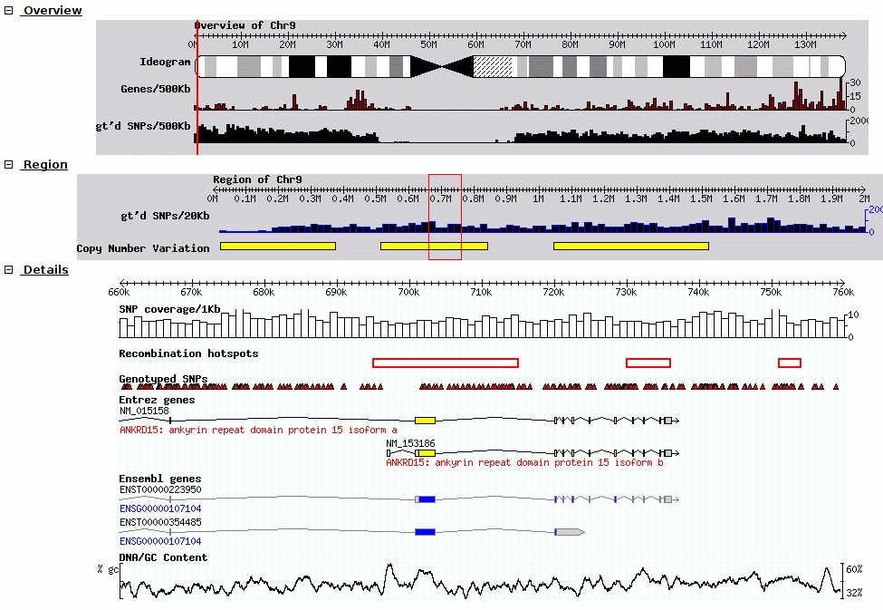

******
Apollo
******

Background
==========

Apollo is a Genome Browser. It lets you visualize genes on a genome,
create and edit genes, and create and edit annotations on those genes.

.. important::

    We have been using another browser called Artemis up until this
    semester. Please bear with us for any issues encountered.
    `Eric <mailto:esr@tamu.edu>`__ is the primary point of contact for
    help using Apollo, or reporting any bugs encountered during use.

Genome Browsers are a vital tool for rapidly annotating genomes. They
let you visualize multiple data sources and help you synthesize those
into a rational set of annotations. But, what are annotations? From the
Pipeline discussion:

.. pull-quote::

    Annotation is the addition of descriptive features to a DNA
    sequence, such as a protein's function, or locating tRNAs, and
    terminators. The annotation process we do is 100% computer based, so
    keep in mind that until an annotation is experimentally tested in
    the lab, it is putative or assumed based on an educated hypothesis.

Definitions
-----------

Static
   Unmodifiable. This is often used to refer to a set of "static" files made
   available over the web, or some other computer resource which cannot be
   modified. (Note that cannot be modified simply means that that exact file
   cannot be modified, but it is often possible to replace it with an
   updated version which is modified)

Instance
   A specific copy of (usually) a web service made available over the
   internet. Given that the same web service could be duplicated and both
   could be accessible to users, we use the term "instance" to refer to a
   specific copy of a service.

Credentials
   Username and password. Also may be used to mean an "API Key" which you
   can consider as a combined username and password

GMOD, GBrowse, JBrowse, Apollo, what's it all mean?
---------------------------------------------------

This section will be a bit of history about Genome Browsers, and while
not important to the annotation process, it can be helpful to know what
the terms means and how the parts all fit together.

We use a lot of software under the umbrella term of GMOD, the `Generic
Model Organism Database <http://www.gmod.org/wiki/Main_Page>`__

The GMOD project collects open source software under a single umbrella,
all related to the idea of publicly accessible, open source Model
Organism Database (MOD). These are important, as historically every lab
did their own thing. By having, at the very least, a common set of
software for MODs, everyone could benefit from interoperability.
Software that talked to one MOD could be re-used when talking to another
MOD.

GBrowse
~~~~~~~

`GBrowse <http://gmod.org/wiki/GBrowse>`__ was one of the earlier genome

browsers, and continues to have wide popularity as it handles massive
datasets quite well.

.. rst-class:: panel panel-primary

   Screenshot of GBrowse from `GMOD Wiki <http://gmod.org/wiki/File:GBrowse_screenshot1.png>`__

Tracks are rendered on the server, and the client view the genome and
datasets through a set of static images shown to the user.

JBrowse
~~~~~~~

We do not use GBrowse, we use JBrowse. JBrowse and GBrowse are related
and attempt to solve the same problem, JBrowse is just a more modern,
javascript version that does all of the processing on the client. This
can make JBrowse much more responsive to user interactions, like how
Google Maps was an improvement over previous web maps which required you
to click and the page to refresh to load a new section of the map.

.. rst-class:: panel panel-primary
.. figure:: img/JBrowse_alignment_and_coverage.png

   Screnshot of a JBrowse instance. In this figure, JBrowse is shown displaying
   some alignments of sequencing reads to a genome. JBrowse has the ability to
   do things like dynamically colouring reads based on multiple properties,
   include read quality and direction.

   JBrowse automatically has generated both a sequencing depth track (blue) and
   a set of individual reads. Neither of these tracks were pre-computed.

Many labs have deployed JBrowse instances to help showcase their
annotation efforts to the community, and to make their data accessible.
`Here <http://jbrowse.org/code/JBrowse-1.12.0/?data=%2Fgenomes%2Fflybase-dmel-5.52-genes&loc=2L%3A10293790..10309642&tracks=DNA%2CGenes&highlight=>`__
you can see a demonstration of *Drosophila melanogaster* genes from
FlyBase in JBrowse and play around with it.

Note that JBrowse is a *static visualization tool*, you cannot make any
changes to the data, you cannot provide annotation and save them. It is
a "Read Only" view of genomes and annotations.

Apollo
~~~~~~

Apollo takes JBrowse one step further and adds infrastructure for
community annotation; it provides a "Read+Write" view of genomes. You
can create new gene features, new annotations on those features, and
these are shared with everyone who has access to the Apollo server.

Apollo embeds JBrowse, so if you are familiar with JBrowse, many of the
same skills apply.

Annotation File Formats
-----------------------

There are two formats you need to be aware of during genome annotation.

1. Fasta, the format used to store DNA and protein sequences.
2. GFF3, a widely used format for storing genome annotations.
3. GenBank, an older format used by NCBI

Fasta
~~~~~

Many of you may have seen a fasta formatted sequence before, but briefly
it looks like:

::

    >phiX  Complete genome sequence of phage X
    ACTGACTGATCGACTGCGTACGATCGACTGACT
    CTGCGTACGATCGACTGACTACTGACTGATCGA
    ...

Each sequence starts with a ``>``, and has a "fasta ID" after it. Some
sequences have a "description" after the sequence, like the in the above
"Complete genome..."

The sequences contained within a fasta file may be DNA, RNA, or protein
sequences.

GFF3
~~~~

.. sidebar:: Eukaryotic Gene Model

   .. figure:: ./img/09-04.jpg
      :width: 100%

      This model is not used by phages, but is used by the storage format that all
      of our data is stored in.

Many of you are probably familiar with the eukaryotic gene model.
This model captures a lot of information about the biological process
behind producing proteins from DNA, such as mRNAs, transcription, and
alternative splicing. GFF3 files thus have to encode these complex,
hierarchical, parent-child relationships.

Let's look at what a GFF3 file looks like:

::

    ##gff-version 3.2.1
    ##sequence-region   ctg123 1 1497228
    ctg123 . gene            1000  9000  .  +  .  ID=gene00001;Name=EDEN

    ctg123 . mRNA            1050  9000  .  +  .  ID=mRNA00001;Parent=gene00001;Name=EDEN.1

    ctg123 . exon            1201  1500  .  +  .  ID=exon00002;Parent=mRNA00001
    ctg123 . exon            3000  3902  .  +  .  ID=exon00003;Parent=mRNA00001
    ctg123 . exon            5000  5500  .  +  .  ID=exon00004;Parent=mRNA00001
    ctg123 . exon            7000  9000  .  +  .  ID=exon00005;Parent=mRNA00001

    ctg123 . CDS             1201  1500  .  +  0  ID=cds00001;Parent=mRNA00001;Name=edenprotein.1
    ctg123 . CDS             3000  3902  .  +  0  ID=cds00001;Parent=mRNA00001;Name=edenprotein.1
    ctg123 . CDS             5000  5500  .  +  0  ID=cds00001;Parent=mRNA00001;Name=edenprotein.1
    ctg123 . CDS             7000  7600  .  +  0  ID=cds00001;Parent=mRNA00001;Name=edenprotein.1

And the visual representation of the text

At the top level we see a "gene" (3rd column), which spans from 1000 to
9000, on the forward strand (7th column), with an ID of ``gene00001``
and a Name of ``EDEN``.

Below the gene, is an mRNA feature. We can infer that it is "below" in
the hierarchy based on the last column which has a *Parent* of
``gene00001``. Similarly all four exons and all four CDSs have a Parent
of ``mRNA00001``. ``ID``, ``Name``, and ``Parent`` are all known as
*feature attributes*. Metadata about a feature. However, more
information than just the names, IDs, and relationships goes into
feature attributes. Often you will see Notes, sometimes Products, and
many more. Only a couple of these attributes have standards defining
what information they contain, the rest are free to be used as you like.

All of this is a little bit excessive for phages where exons are rare,
and mRNAs not involved, but nevertheless, we want to make sure our data
is accessible to other researchers so they can do experiments building
on our work.

(It is more important that you know the format exists, and that it
encodes parent-child biological relationships, than that you know the
precise specifics of what each column means.)

GenBank
~~~~~~~

In stark contrast to the elegance of the GFF3 format (tab separated,
key-value pairs, easy to work with), we have the older GenBank format.
This is a fixed-width format which has a "flat" gene model, and lacks
any way to represent the hierarchical relationships that are
biologically relevant.

::

    LOCUS       NC_001133             230218 bp    DNA     linear   PLN 14-JUL-2011
    DEFINITION  Saccharomyces cerevisiae S288c chromosome I, complete sequence.
    ACCESSION   NC_001133
    VERSION     NC_001133.9  GI:330443391
    DBLINK      Project: 128
    KEYWORDS    .
    SOURCE      Saccharomyces cerevisiae S288c
      ORGANISM  Saccharomyces cerevisiae S288c
                Eukaryota; Fungi; Dikarya; Ascomycota; Saccharomycotina;
                Saccharomycetes; Saccharomycetales; Saccharomycetaceae;
                Saccharomyces.
    REFERENCE   1  (bases 1 to 230218)
      AUTHORS   Goffeau,A., Barrell,B.G., Bussey,H., Davis,R.W., Dujon,B.,
                Feldmann,H., Galibert,F., Hoheisel,J.D., Jacq,C., Johnston,M.,
                Louis,E.J., Mewes,H.W., Murakami,Y., Philippsen,P., Tettelin,H. and
                Oliver,S.G.
      TITLE     Life with 6000 genes
      JOURNAL   Science 274 (5287), 546 (1996)
       PUBMED   8849441
    FEATURES             Location/Qualifiers
         source          1..230218
                         /organism="Saccharomyces cerevisiae S288c"
                         /mol_type="genomic DNA"
                         /strain="S288c"
                         /db_xref="taxon:559292"
                         /chromosome="I"
         gene            complement(1807..2169)
                         /gene="PAU8"
                         /locus_tag="YAL068C"
                         /db_xref="GeneID:851229"
         mRNA            complement(<1807..>2169)
                         /gene="PAU8"
                         /locus_tag="YAL068C"
                         /transcript_id="NM_001180043.1"
                         /db_xref="GI:296142466"
                         /db_xref="GeneID:851229"
         CDS             complement(1807..2169)
                         /gene="PAU8"
                         /locus_tag="YAL068C"
                         /note="hypothetical protein, member of the seripauperin
                         multigene family encoded mainly in subtelomeric regions"
                         /codon_start=1
                         /protein_id="NP_009332.1"
                         /db_xref="GI:6319249"
                         /db_xref="SGD:S000002142"
                         /db_xref="GeneID:851229"
    ...
    ORIGIN
            1 ccacaccaca cccacacacc cacacaccac accacacacc acaccacacc cacacacaca
           61 catcctaaca ctaccctaac acagccctaa tctaaccctg gccaacctgt ctctcaactt

There are a few major regions of a GenBank file:

1. The header (Starting with LOCUS...)
2. The feature table (Starting with FEATURES)
3. The sequence

The *header* will tell you information like:

-  Sequence ID, NC\_001133 in the above example,
-  Genome or chromosome length
-  Annotation set version (9, from ``VERSION NC_001133.9``)
-  References

The *feature table* usually starts with a "source" type feature which
contains metadata about the chromosome or genome. Features consist of a
feature type key on the left, and key value pairs on the right formatted
as ``/key="Value..."``.

Lastly, there is the sequence data. In contrast to GFF3 which stores
sequence data in standardised fasta format, GenBank uses sequence
separated into six columns of ten characters, with the sequence index
annotated on the left.

Annotation
==========

On to actually using Apollo! We'll go through an example
annotation.You're welcome to follow along with this at home and
familiarize yourself with Apollo before class. The example presented
here will be open for everyone in the class to use, so images may not
reflect the current annotations made.

.. warning::

    As of 2016-02, the Apollo service does NOT work under IE11

There are two primary components to annotation:

1. Structural annotation
2. Functional annotation

In structural annotation you will take the output of several gene
callers which have identified possible genes in your phage genome and
use these results to annotate putative genes in Apollo. Structural
annotations consist of locations of genomic features, like genes and
terminators.

Functional annotation will entail identifying possible gene functions
based on multiple sources of evidence. We will go into more detail in
the first lecture on what it means to do structural and functional
annotations.

Apollo in Galaxy
----------------

Apollo-Galaxy integration was something developed by the Center for Phage
Technology, specifically for this course, though it is slowly seeing much wider
adoption in the annotation community. This section will cover the generalised
use of Apollo in Galaxy, not specific to any workflow implementation.

.. rst-class:: panel
.. figure:: ./img/name-store.png

   This error might appear, from time to time. It is safe to ignore.

Registration
~~~~~~~~~~~~

In order to log in to Apollo, you'll need to register for an account.

You can register for an account by
running `a Galaxy
tool <https://cpt.tamu.edu/galaxy/root?tool_id=edu.tamu.cpt2.webapollo.create_account>`__,
which will generate your credentials for you. If you ever forget your credentials and
cannot find the item in your history, you can re-run this, and it will
generate a new password for you.

Simply fill out the form:

.. rst-class:: panel panel-primary

And hit the **Execute** button. Once the tool is done running, the
dataset will turn green. You will then click the "View Dataset" eyeball
button to see your password. (You don't need to memorize this password
or write it down anywhere. You can always come back to Galaxy to view
it.)

.. rst-class:: panel panel-primary

    If you ever lose your Galaxy history with the password, just come back to
    Galaxy and re-run the tool. The password will be saved there for you.

JBrowse In Galaxy
~~~~~~~~~~~~~~~~~

If you're familiar with JBrowse, a view of Apollo should look familiar to you:

.. rst-class:: panel panel-primary

   Notice the JBrowse window embedded within the Apollo interface. Apollo
   integrates with the JBrowse software to provide the ability to make
   annotations and save them.

The CPT developed a tool called JBrowse-in-Galaxy (JiG) which allows you to build
JBrowse instances within Galaxy. JBrowse instances are traditionally configured
through a complex and manual process at the command line. JiG represents the
first ever visual JBrowse configuration and construction tool.

.. rst-class:: panel panel-primary

   The generalized JBrowse workflow. JBrowse is simply a tool for displaying the
   results of a bioinformatic analysis in a standardised way.

Apollo takes, as its input, complete JBrowse instances. To view any data in
Apollo, a JBrowse instance needs to be configured first.

.. rst-class:: panel panel-primary

   The JBrowse-in-Galaxy tool is an extremely complex tool, with a very detailed
   manual (at the bottom of the page in Galaxy). If you need to do anything
   beyond showing simple GFF3 files, you'll need to read this manual.

   If you just wish to display the genome and associated datasets in Apollo, you
   do not need to produce a "standalone instance." That is only required if you
   wish to view the (static) JBrowse instance in Galaxy.

Once you've created a JBrowse instance, you'll find it in your history

.. rst-class:: panel panel-info

   Viewing a JBrowse instance produced within Galaxy.

If you chose to produce a "standalone instance," you'll be able to click the
eyeball icon and view the dataset.

Moving Data from Galaxy to Apollo
~~~~~~~~~~~~~~~~~~~~~~~~~~~~~~~~~

Now that you have:

1. A complete JBrowse instance
2. Apollo credentials

You're ready to start talking to the Apollo service.

.. rst-class:: panel panel-primary

   The general Apollo/JiG/Galaxy workflow. Data is built up in Galaxy in the
   form of a JBrowse instance, which is pushed to the Apollo service in the
   Create or Update step, and transfers data to Apollo. The Annotate step is
   simple a convenience method for accessing Apollo. Apollo is also available at
   `https://cpt.tamu.edu/apollo <https://cpt.tamu.edu/apollo>`__. These methods both point at the same instance of
   Apollo.

The first tool we'll use is a tool named **Create or Update** which lets us
create, or update, an organism in Apollo with new data from Galaxy in the form
of a JBrowse instance.

.. rst-class:: panel panel-primary

   It is not required (but highly recommended) to fill out the species field
   appropriately. Additionally it is not required to make anything public
   (available to the public at large) but it is encouraged.

This step will transfer data to Apollo, and produce a JSON file. The output JSON
file contains some metadata about the organism. You will never need any information
from this file.

Now that your data is available in Apollo, you can access it at `Apollo
<https://cpt.tamu.edu/apollo/>`__, or via the **Annotate** convenience method
which is provided. The Annotate tool takes the JSON file from a *Create or Update*
step, and loads Apollo, directly in Galaxy.

.. rst-class:: panel panel-primary

   Apollo accessed from within Galaxy

Finding Our Way Around
----------------------

You'll be presented with a two-pane display. On the left is an embedded
JBrowse instance:

.. rst-class:: panel panel-primary

   JBrowse is a key component of Apollo. Apollo adds some additional options to
   JBrowse's top menu, and the pale yellow track labeled "User-created Annotations"

JBrowse, embedded in Apollo, is slightly different than a normal
JBrowse. The movement controls are all the same:

-  you can use the magnifying glasses to zoom in and out of the genome
   and its data
-  the arrow icons will move you up and downstream along the genome
-  Selecting or clicking on locations along the genome ruler (they grey
   box at the top of the genome, 0 bp; 20,000bp; 40,000bp; etc.) will
   allow you to zoom in and move to specific regions

The menu bar has some useful options, some that aren't available in
"standard" JBrowse:

-  **File** allows adding some special track types. We will not be using
   these options, but it's recommended that you explore them.
-  **View** will let you set some useful options:

   -  "Color by CDS frame" is a popular option during annotation. It
      will colour each coding sequence by which frame the reading frame
      is in.
   -  "Show Track Label" is an incredibly useful feature to hide the
      track's labelling, allowing you to annotate small features near
      the end of the genome, which would otherwise be hidden by the
      track label (E.g. "User created annotations")

The **pale yellow** track that is visible is the **User Created
Annotation** track. During the annotation of a genome, gene features
will be added to this track and edited, thus this track will always be
visible to you.

Back to the overview ,on the right is the **Genome Selector**, which
lists all of the organisms accessible to you.

.. rst-class:: panel panel-primary

   Apollo uses the concept of "Organisms" with "reference sequences" below it.
   Each organism can have one or more reference sequences. In higher order
   organisms those often correspond to multiple chromosomes. For phage uses they
   are most often used to correspond to different assemblies of the genome.

The **Ref Sequence** tab lists all of the sequences (associated with a
given organism) that are accessible to you.

.. rst-class:: panel panel-primary
.. figure:: ./img/apollo/apollo-2-ref-seq-selection.png

   This panel allows you to switch between reference sequences and filter them
   (in the event that there are many reference sequences).

   Double clicking on the name will cause that sequence to load in the
   JBrowse window on the left.

For those familiar with JBrowse, you will notice that the track
selection menu is missing. You will find it under the **Tracks** tab on
the right hand side.

.. rst-class:: panel

   Track Selection

If you select all three of the tracks (*GeneMarkS*, *MetaGeneAnnotator*,
and *Glimmer3*), they will show up in JBrowse. You may find that this
produces an absolutely overwhelming amount of information:

.. rst-class:: panel

   Overwhelming

In order to combat that, you should zoom in

.. rst-class:: panel

   Zooming

You may find that you wish to focus solely on the annotation process,
without any distractions from the Apollo portion of the interface. You
can hide that easily.

.. rst-class:: panel

   Hiding Apollo

Let's zoom down to the level of a single gene:

.. rst-class:: panel

   Here we can begin to compare the gene models of these three genes. One of the
   three has a Shine Dalgarno sequence anotated. The CPT filters all SD
   sequences to ensure that only high quality ones are visible.

Great! Here we see the very first gene called by the three *gene
callers* that we use. (There is more information on gene calling
available in the
`Pipeline <https://cpt.tamu.edu/jenkins/job/phage-bioinfo-textbook/lastSuccessfulBuild/artifact/main.pdf>`__
document. We will cover that separately. A gene call is a possible
location for a gene)

.. note::

    Your work is saved automatically, instantaneously. You do not need to worry
    about losing changes.

Workflows
=========

There are a couple of workflows which you will run as part of the Apollo and
Annotation process. The first covers structural annotation (genes, terminators,
tRNAs), while the second covers functional annotation (blast, interpro, etc.).

Workflow - Structural
---------------------

This workflow will run your genome through three automated gene callers,
*MetaGeneAnnotator*, *GeneMarkS*, and *Glimmer3*. Additionally tRNA and
terminator finding tools will be run.

1. Open the workflow in Galaxy
   (`Public <https://cpt.tamu.edu/galaxy-pub/u/eric-rasche/w/pap-2016-v8-structural>`__,
   `TAMU <https://cpt.tamu.edu/galaxy/u/eric-rasche/w/pap-2016-v8-structural>`__)

2.  Select import at the top right, in green.

    .. rst-class:: panel
    .. figure:: ./img/import-workflow.png
       :alt:

       **NB: This is a generic image**, your workflow may have a
       different name. You need to use the button at the right to import the
       workflow

3.  Once you've imported it, you'll want to **start using this
    workflow**

    .. rst-class:: panel
    .. figure:: ./img/gx-import-ok.png
       :alt:

4.  Again, using the dropdown to actually **Run workflow**

    .. rst-class:: panel
    .. figure:: ./img/gx-run-imported.png
       :alt:

       **NB: This is a generic image**, your workflow may have a
       different name.

6.  Specify the following:

    +------------------------------------------+-----------------+------------------------------------------------------------------------------------------------------------------------------------+
    | Step                                     | Field           | Data                                                                                                                               |
    +==========================================+=================+====================================================================================================================================+
    | Step 1: Input Dataset                    | Fasta Genome    | Your phage's **Fasta Genome**                                                                                                      |
    +------------------------------------------+-----------------+------------------------------------------------------------------------------------------------------------------------------------+

7.  **Execute**

    .. rst-class:: panel
    .. figure:: ./img/gx-execute.png
       :alt:

8.  If everything went successfully, you'll see a notice, you should
    **follow the instructions**

    .. rst-class:: panel
    .. figure:: ./img/gx-wf-success.png
       :alt:

9.  This workflow will load your genome and the gene call evidence into
    Apollo. From there you will need to go through the genome and select
    the likely gene calls. Remember that the three gene callers are
    correct maybe 90-95% of the time. Your task is to examine each
    likely gene region, and select the best call.

    .. rst-class:: panel
    .. figure:: ./img/better.png
       :alt:

       Dark green is probably a better choice than light green in this
       case.

10. This is **bad**

.. rst-class:: panel

This is **good**

.. rst-class:: panel

You will need to update all of your translation start sites if Apollo
has messed them up. If you see cases like this, zoom in on the organism, and
right click the location where translation should start, and select **Set
Translation Start**

.. rst-class:: panel

.. important::

   If you have any questions on the process, please feel free to contact `Eric
   <mailto:esr@tamu.edu>`__.

Workflow - Functional
---------------------

Once your structural annotation is completely done, you're ready to move on to
the functional annotation. If you want a second set of eyes, double-checking
your genome, feel free to talk to Eric. Reviewing your gene calls now and
getting them right will save you *significant* amounts of time later.

1. Open the workflow in Galaxy
   (`Public <https://cpt.tamu.edu/galaxy-pub/u/eric-rasche/w/pap-2016-v8-functional>`__,
   `TAMU <https://cpt.tamu.edu/galaxy/u/eric-rasche/w/pap-2016-v8-functional>`__)

2.  Select import at the top right, in green.

    .. rst-class:: panel
    .. figure:: ./img/import-workflow.png

       **NB: This is a generic image**, your workflow may have a
       different name. You need to use the button at the right to import the
       workflow

3.  Once you've imported it, you'll want to **start using this
    workflow**

    .. rst-class:: panel
    .. figure:: ./img/gx-import-ok.png

4.  Again, using the dropdown to actually **Run workflow**

    .. rst-class:: panel
    .. figure:: ./img/gx-run-imported.png

       **NB: This is a generic image**, your workflow may have a
       different name.

6.  Fill out the workflow form appropriately. You should specify the organism's
    common name at the very least. If the organism has multiple reference
    sequences and you only wish to annotate one, you'll need to specify that
    as well. You should not need to change any other settings.

    .. rst-class:: panel
    .. figure:: ./img/gx-functional-form.png

       **NB: This is a generic image**, your workflow may look slightly
       different. In most cases, you will only need to specify the organism's
       common name and not the reference sequence.

7.  **Execute**

    .. rst-class:: panel
    .. figure:: ./img/gx-execute.png
       :alt:

8.  If everything went successfully, you'll see a notice, you should
    **follow the instructions**

    .. rst-class:: panel
    .. figure:: ./img/gx-wf-success.png
       :alt:

9.  This workflow will load your genome and the gene call evidence into
    Apollo. From there you will need to go through the genome and annotate it
    based on the evidence in the various tracks.

.. important::

   If you have any questions on the process, please feel free to contact `Eric
   <mailto:esr@tamu.edu>`__.
