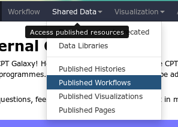

**********************
Introduction to Galaxy
**********************

Introduction
============

Galaxy is a platform for doing reproducible bioinformatics research. It
provides a friendly interface to a vast number of complex command line
tools, and it encourages consistent science by using identical software
and interfaces across all Galaxy instances.

At the CPT we depend on Galaxy for all of our computer-based analysis;
we can launch long running jobs and return to our lab work, while Galaxy
keeps track of where and how far along our analysis is, during runs of
our pipelines.

.. rst-class:: panel

   Main Galaxy View

Galaxy consists of a three panel interface. On the left are your tools,
in the center you'll do your analysis and view the results, and on the
right is your history.

.. rst-class:: panel

   Tool Panel

These are all groups of tools you can run in Galaxy. A tool is something
that generates or transforms data. Some examples of tools would be a
Gene Caller, which reads your genome and returns a list of gene
locations, or Blast, which would search your protein sequences against a
database.

In Galaxy, tools are simple interfaces to the complex software behind
them. Galaxy tools enhance productivity by ensuring that your input
files are the correct format at every step.

.. rst-class:: panel

   History Panel

The history panel keeps track of what you've done. Each entry is called
a "dataset" in Galaxy terminology. Datasets are usually just a single
file (like a fasta genome), but may be complex files (like html web
pages). The colors indicate in which of the three states a job could be;
grey for jobs that have been submitted to Galaxy, yellow for a jobs that
are currently running, and red/green for a jobs that are completed.

.. warning::

    Sometimes jobs fail and turn red! If they do, don't worry--it likely
    isn't your fault. Just be sure to click the bug icon so we can be made
    aware of what went wrong.

.. rst-class:: panel

   The bug icon is in the bottom left. Please click it if you see it!

Tools
=====

Tools are the central feature of Galaxy, they're what Galaxy is all
about: easy-to-use access to powerful command line tools. We use the
language "tool" to describe some command line program that has been
"wrapped" for use in Galaxy. Many of the command line options are
available to be tweaked and fiddled with in the Galaxy tool interface.

.. rst-class:: panel

   This Galaxy tool has a large number of options. Many tools are highly
   configurable to meet the needs of a wide variety of end users.

To run a tool, first read the tool's help box at the bottom, it may give
you very important information regarding running the tool, and the
options available to you.

Next go over the options in the tool interface, many are set to default
values and those options may not be what you intended to happen.

Nearly all Galaxy tools process some input files and produce some output
files. When you have an input box that lets you select a file, Galaxy
will ensure that you cannot pass datasets of an incorrect format to a
tool.

When you've finished configuring a tool, and **execute** it, it will
show up as a set of output files in the history on the right, which
we'll cover in the next section..

Jobs
====

A job is a tool run with a set of parameters, and it sits somewhere in
Galaxy's queue. We have lots of Galaxy users and can only run so many
jobs at once. Jobs produce one or more output files.

Looking at an individual output dataset, there will be several features
that will be of interest to you, and a couple that won't:

In this example we see dataset #29, which is a table of Start Codon
Usages.

.. rst-class:: panel

   An example Dataset

This is the collapsed view of a dataset. You'll see three icons, an eye,
a pencil, and an X.

-  The eye icon will display the dataset in the main window
-  The pencil icon is used to edit the information about the dataset
   (i.e. metadata, such as filename, file type, and other more obscure
   facts)
-  And the X icon will delete a dataset, for which you no longer have
   any use

When you delete a dataset accidentally, don't worry! It isn't gone
permanently.

.. rst-class:: panel

   History Header

See the text "6 deleted"? Clicking on the word "deleted" will show you
the deleted items in your history.

Clicking anywhere on the title of the dataset, "Start Codon Usages" will
expand to the full view:

.. rst-class:: panel

   Example Dataset in the expanded view.

At the bottom of the dataset you can see a preview of the table. Near
the top you'll note the it is a "tabular" format. Galaxy keeps track of
file formats to ensure you only use correctly-formatted data for tools.

The history dataset view is information dense, so we'll go over the
icons, their colloquial names, and their functions.

1. **Eyeball** views the dataset
2. **Pencil** modifies metadata
3. **X** sends a dataset to the trash. Remember, you can recover deleted
   datasets.
4. **Save** downloads the dataset to your hard-drive. You don't *need*
   to do this, as Galaxy will always have a copy for you.
5. **Information** views details about the tool that was run and how it
   was configured.
6. **Rerun** is a very commonly used button. This lets you re-run the
   tool, with the same parameters configured.

   -  Need to run the same tool with slightly different parameters?
      Don't waste time filling out the tool form; re-run it and tweak
      those.
   -  Job failed? Try modifying the tool inputs and re-running it.

7. **Visualize** lets you visualize your dataset in a couple of
   different ways. We don't use this very often in the course as it
   isn't appropriate to our analysis. However, some of the useful
   visualizations include: a "charts" visualization that lets you build
   graphs from your tabular dataset, and an Multiple Sequence Alignment
   (MSA) visualization plugin in Galaxy which lets you interactively
   explore MSAs.
8. **Tags** let you annotate datasets with tags. We don't use this
   feature.
9. **Comments** let you comment on a dataset to remind yourself why you
   did it, or maybe to annotate some interesting results you found in
   the output.

Histories
=========

Histories are used to separate out your analyses and help you keep track
of what you've done. You might make a new history for a task like
assembling a genome, annotating a genome, or doing some comparative
analysis between phages. It's good practice to title your history
something that will be useful to you when you come back later. Who knows
what "Untitled History" last edited on 2012-02-01 was for? Good names
are important!

At the top right of your history you'll see a couple icons. A refresh
symbol, a gear, and the new history view.

.. rst-class:: panel

   History Menu

The refresh button can be used to refresh your history if you're
impatient, like I can be. The gear icon provides you with the old
interface to switch histories and modify the view. We'll be using the
new "View all histories" view:

.. rst-class:: panel

   The new (in 2015) Galaxy History Switcher. It is a huge improvement
   over the old one because you can easily move datasets between
   histories

At the top left you'll see a **done** button, which will let you exit
this view when you're done. On the left is your current history. To the
right of that are your other histories. The **switch to** button allows
you to switch histories. Any new tools you run will be done in this
history.

Uploading Data
==============

Switch back to the main view of Galaxy (i.e. click **done** if you're
still in the switch history menu from above). If you ever find yourself
lost in Galaxy, you can always click **Analyze Data** on the big blue
bar at the top, and it'll take you home.

.. rst-class:: panel

   Upload

This button will bring up your upload menu and allow you to import data
into Galaxy.

.. rst-class:: panel

   Upload Window

You can drag and drop files to upload them, or use the **Choose Local
File** button in the bottom menu.

.. rst-class:: panel

   Upload Menu

There are a couple other options for advanced users:

-  **Choose FTP file** allows you to select a file you've uploaded via
   FTP. For files >2GB, this is required.
-  **Paste/Fetch data** allows you to paste in a bit of text or a URL.
   Galaxy will import that into your history.

Once the file has been detected by Galaxy, you'll see it pop up in the
upload window:

.. rst-class:: panel

   Uploading File

You can set the file type if Galaxy doesn't detect it properly, but that
is a rare case, and before overriding Galaxy you should double check
that your file is formatted properly.

When you've selected all the files you wish to upload, click **Start**
in the bottom right of the upload menu.

.. rst-class:: panel

   Starting Upload

The dataset will indicate to you that it is uploaded in the upload
window,

.. rst-class:: panel

   Uploading...

at which time you can close that window with Escape or the **Close**
button in the bottom right.

The dataset will turn yellow

.. rst-class:: panel

   Processing an upload

And then green when it is ready.

.. rst-class:: panel

   Finished upload

Workflows
=========

Workflows are merely collections of jobs where some jobs depend on the
outputs of other jobs. Say you're faced with a task like the following:

1. Load data from apollo
2. Extract all of genes as DNA sequences
3. Translate those to protein sequences
4. Run those proteins through BlastP

If you did these tasks one by one, you would have to keep track of *at
least* 4 different files, one as the output of each step. You have to
wait for each program to finish, before you can execute the next one.
What if step 2 took 10 minutes? And Step 3 took 15? You would have to
check back every few minutes to see if your job was done before you
could start the next.

Thus, enter workflows:

.. rst-class:: panel

   An example workflow encapsulating the four steps from our example
   workflow

Workflows solve numerous problems for us:

-  Run tools immediately

   -  The next step can start as soon as data is available, a human does
      not have to manually start it

-  Discard useless data

   -  In the above example we probably only cared about the output BLAST
      results, we don't care about storing the intermediate files
      forever.

-  Simplified interfaces

   -  In the same way that Galaxy tools hide the complexity of hundreds
      of command line options and working in Linux, Workflows hide the
      complexity of many Galaxy tools.
   -  You, as a user, are probably not interested in the fact that we
      have to extract features from a GFF3 file, and then translate
      those to protein sequences.

.. _galaxy-importing:

Importing
---------

.. rst-class:: panel

   Before you create a new workflow, check the published workflow page.
   Another user may have created a workflow you can use.

You will often be asked to import workflows. You can do this by going to
the **Published Workflow** page, and finding a workflow you're
interested in.

.. rst-class:: panel

   Importing workflows is easy, just click the little down arrow, and
   select "Import"

Running
-------

Workflows which you have created, or imported, are available under the
**Workflow** menu at the top of Galaxy.

.. rst-class:: panel
.. figure:: ./img/gx-wf-mine.png

   Some of the author's Galaxy workflows. The author has somewhere
   around 60 different workflows, as they are instrumental in running
   complex analyses on Galaxy

.. rst-class:: panel

   To run a workflow, click the down arrow, and select the **Run**
   option

The run workflow interface can be somewhat overwhelming. For the large
part, the tools are pre-configured for you. As the course progresses
we'll cover in detail what each portion of the workflow does.

.. rst-class:: panel

   Running a workflow. Some boxes which are automatically expanded may
   require your attention, the ones which are closed may not require
   attention

Just like with tools, there is an **Execute** button at the bottom which
will launch the workflow.

Recap
=====

At this point you should be fairly comfortable:

* Uploading data
* Job Outputs
* Running Tools
* Switching between histories
* Importing workflows
* Running workflows
